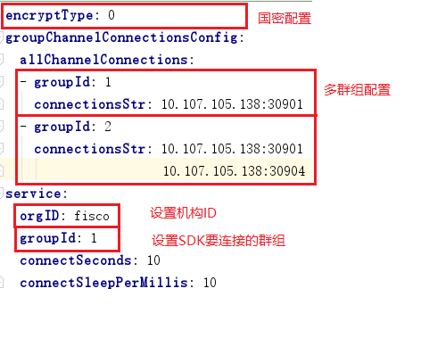

#### 此项目是[FISCO-BCOS web3sdk](https://github.com/FISCO-BCOS/web3sdk)的spring boot版本demo;

- 如果您对wec3sdk项目还不太了解，请查看[https://github.com/FISCO-BCOS/web3sdk](https://github.com/FISCO-BCOS/web3sdk)。
- 如果对spring boot还不太了解，请查看[Spring Boot Application](https://spring.io/guides/gs/spring-boot/)

#### 1.1使用指南

  您可以拉代码直接在此项目上开发(删除test文件下的测试案例即可)。我们在test下面提供基本测试案例，保证你能成功调用智能合约。

   开始开发前，您需要配置 application.yml和拷贝节点上的client.keystore以及ca.crt文件。 配置参考FISCO-BCOS web3sdk项目[https://fisco-bcos-documentation.readthedocs.io/zh_CN/latest/docs/web3sdk/config_web3sdk.html](https://fisco-bcos-documentation.readthedocs.io/zh_CN/latest/docs/web3sdk/config_web3sdk.html)。
    springboot项目配置唯一不同是需把application.xml修改成application.yml。
 application.yml配置如下图：

   

  #### 1.2 编译使用：
  本项目提供了丰富的测试案例和功能，您也可以直接下载代码，使用基本功能。流程如下：

       #===证书和节点配置 ===
	  1. 拉取代码后，在src/test/resources目录下，配置web3sdk的application.yml，
      如上图所示设置sdk要连接节点channel_listen_ip和channel_listen_port。并设置节点所在群组groupId(如果是单群组设置为1即可);

      2. 由于是联盟链,拷贝节点证书文件ca.crt和keystore.p12到web3sdk/src/test/resources目录下；
      3. 具体使用请参看src/test目录下的测试代码，执行相应测试。Application.java类已经帮你产生web3j类，
       这样您可以直接在你的项目代码里注入web3j即可。
       @Autowired
       private Web3j web3j
      4 测试案例中SolidityFunctionWrapperGeneratorTest 测试类可以帮你生成把abi文件转换成相应Java类。
